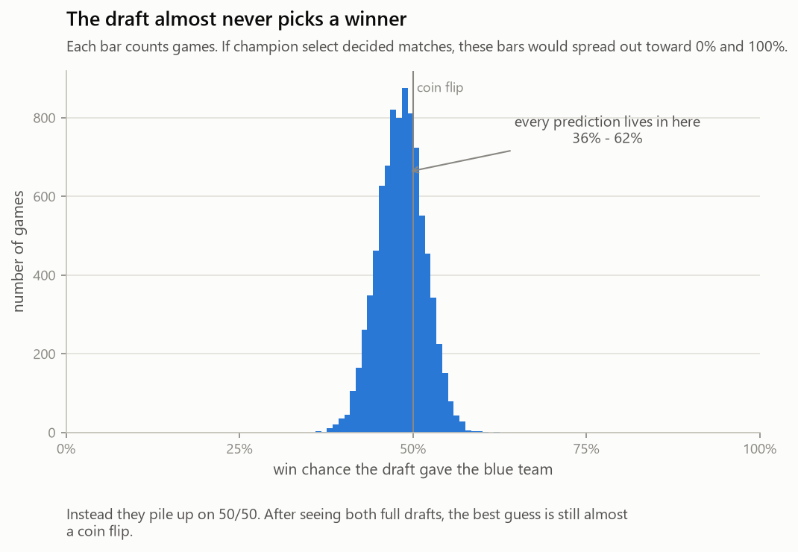
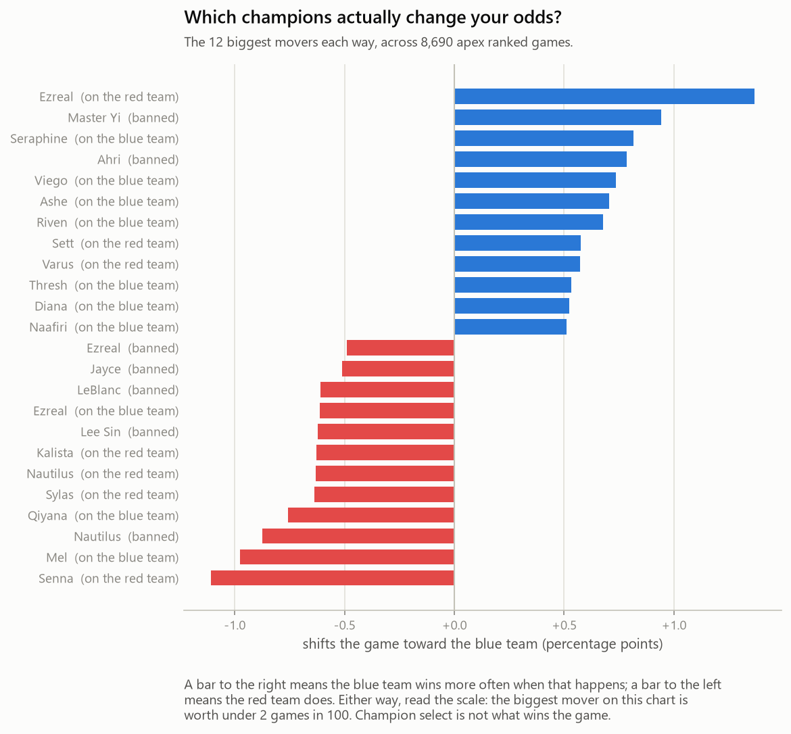
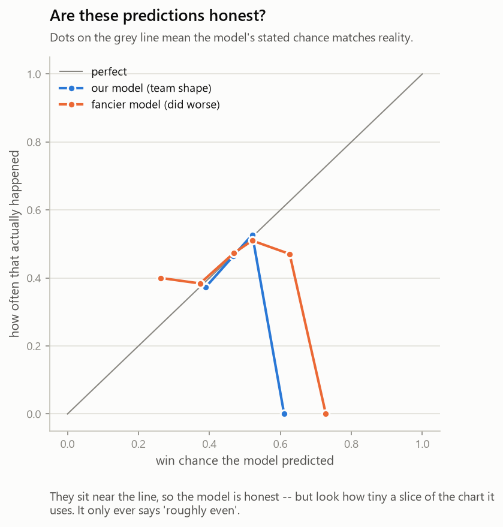
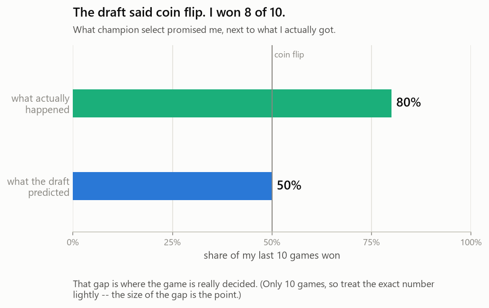

# League Draft Win-Probability

**How much does the draft actually decide a solo-queue game?** This project builds a
calibrated win-probability model from nothing but the two teams' final champion
compositions and bans — then answers the question honestly. The answer, and the whole
point, is: **surprisingly little.**

> The draft alone predicts the winner with **ROC-AUC 0.537** — just **+3.7 points
> above a coin flip** — across **8,690** ranked games. After seeing all ten champions
> and every ban, the model's confidence never leaves the **36%–62%** band. The low
> ceiling *is* the finding: champion select is not what wins the game. The rest is execution.



---

## What's here

| | |
|---|---|
| **Interactive predictor** | [`reports/draft_predictor.html`](reports/draft_predictor.html) — pick 10 champions, watch the win probability update live. Runs offline in one file. |
| **Findings report** | [`reports/report.html`](reports/report.html) — the whole story as a single self-contained page. |
| **Notebooks** | [`notebooks/`](notebooks/) — narrated walk-through: EDA → features → model → my own games. |
| **Pipeline** | [`src/`](src/) — ingest → parse → features → model → predict, each runnable standalone. |

## The finding in three pictures

**Even the strongest champion barely moves your odds.** The biggest mover in 8,690 games
shifts win chance by under two points.



**The model is honest — it just has little to say.** Predictions sit on the calibration line,
but occupy a sliver of the 0–100% axis.



**My own games: the draft called them coin flips.** Held out of training, so this is a real
out-of-sample test.



## How it works

1. **Ingest** ([`src/ingest.py`](src/ingest.py)) — seed from apex players (Master / Grandmaster /
   Challenger) on SEA (South-East Asia), pull their ranked-solo match IDs, dedupe, and cache raw Match-V5
   JSON. Resumable: caching + an ID manifest mean an interrupted pull costs almost nothing.
2. **Parse** ([`src/parse.py`](src/parse.py)) — one tidy row per match: 10 champions by side,
   bans, patch, and the `win` label. Every field is known at champion-select lock, so there is
   **no leakage by construction**. My own games are held out here so they can never be trained on.
3. **Features** ([`src/features.py`](src/features.py)) — three tiers: multi-hot champions + bans
   (Tier 1), archetype aggregates (Tier 2), champion win-rate deltas (Tier 3, optional).
4. **Model** ([`src/model.py`](src/model.py)) — L2-regularised logistic regression vs. LightGBM,
   scored by **nested cross-validation** against a coin flip, a base-rate constant, and a naive
   champion-win-rate rule. Evaluation is calibration-forward: log-loss, ROC-AUC, Brier, calibration.
5. **Predict** ([`src/predict.py`](src/predict.py)) — type in a draft, get a calibrated probability
   and a per-pick breakdown.

## The data

| | |
|---|---|
| Region | SEA (South-East Asia) (platform `sg2 - Singapore`) |
| Queue | Ranked Solo/Duo (420) |
| Ranks | Master 5,860 · Grandmaster 1,918 · Challenger 620 · Unknown 292 |
| Patches | 16.13 + 16.12 |
| Matches | **8,690** |

Champion metadata (class tags, damage-type heuristic) comes from Riot's free Data Dragon; the
engage / enchanter / poke / hard-CC labels in [`champion_labels.csv`](champion_labels.csv) are a
hand-curated first pass.

## Reproduce it

```bash
python -m venv .venv && .venv/Scripts/activate      # Windows; use source .venv/bin/activate on *nix
pip install -r requirements.txt
cp .env.example .env                                # then paste your Riot dev key + Riot ID
```

Then run the pipeline (a dev key is only needed for the two steps that hit the API):

```bash
python src/ingest.py --master 600 --grandmaster 400 --challenger 300 --target 12000
python src/parse.py
python src/build_labels.py       # writes champion_labels.csv from Data Dragon
python src/model.py              # trains, evaluates, writes figures + the saved model
python src/my_games.py --count 40
python src/build_html.py         # interactive predictor
python src/build_report.py       # findings report
```

Try the predictor from the command line:

```bash
python src/predict.py --blue "Aatrox,Vi,Ahri,Jinx,Thresh" --red "Garen,Lee Sin,Orianna,Caitlyn,Leona" --bans "Yasuo,Zed"
```

## Model comparison

Out-of-fold, identical folds, hyperparameters tuned inside each fold (nested CV):

| Model | Log-loss ↓ | ROC-AUC | Brier ↓ | Accuracy |
|---|---|---|---|---|
| Team-composition model ⭐ | 0.6903 | 0.537 | 0.2486 | 53.4% |
| Naive champion win-rate rule | 0.6919 | 0.524 | 0.2494 | 52.1% |
| Champion-identity model | 0.6921 | 0.516 | 0.2495 | 51.6% |
| Gradient boosting | 0.6924 | 0.523 | 0.2496 | 52.3% |
| Always predict the base rate | 0.6925 | 0.500 | 0.2497 | 51.8% |
| Coin flip | 0.6931 | 0.500 | 0.2500 | 51.8% |

Two things stand out. The gradient-boosted model **lost** to plain logistic regression — the extra
complexity found no signal to exploit. And among the linear models, the **team-composition** view
(engage, hard CC, frontline, AD/AP balance) edged raw **champion identity**. At a smaller sample the
two were indistinguishable; with more data, *what kind of team you built* carries slightly more signal
than *which exact champions* are on it. Tuning regularisation mattered more than model choice — an
earlier hand-picked penalty was beaten by a coin flip (overconfident, not wrong on average).

*The interactive predictor uses the champion-identity model for a per-pick breakdown; it scores within
a hair of the team-composition model.*

## Limitations

- **One region, apex ranks only.** SEA (South-East Asia), Master–Challenger. Do not assume it transfers to other servers or lower elos.
- **Patch scope** (16.13 + 16.12) — a meta snapshot, not permanent champion truths.
- **Correlational, not causal** — no pick order, no counter-pick context; a coefficient reflects who
  picks a champion and into what, not its intrinsic strength.
- **Hand-curated archetype labels** for the four subjective columns.
- **Approximate rank labels** — Match-V5 has no game-tier field, so tier is inferred from the seed player.
- **Solo-queue variance is enormous** — ten players, tilt, one early misplay. That is exactly the finding.

## Non-goals

No live client reading, no web app or hosting, no deep learning, no timeline features, no other
regions. Free Riot dev key and open-source libraries only.

---

*This project isn't endorsed by Riot Games and doesn't reflect the views or opinions of Riot Games
or anyone officially involved in producing or managing Riot Games properties. League of Legends is a
trademark of Riot Games, Inc.*
